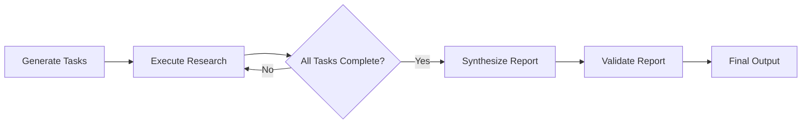

# 🤖 Autonomous Research Agent with LangGraph


An intelligent research automation system that breaks down complex queries into manageable tasks, executes research across multiple sources in parallel, and synthesizes comprehensive reports with built-in quality validation.

## ✨ Features

- **🧠 Intelligent Task Decomposition**: Automatically breaks complex research queries into 3-4 actionable subtasks
- **📚 Multi-Source Research**: Integrates ArXiv academic papers and web search via Tavily
- **⚡ Parallel Processing**: Executes tasks concurrently within priority groups for optimal efficiency
- **🎯 Smart Tool Selection**: Automatically chooses appropriate research tools based on task content
- **✅ Quality Validation**: Built-in report validation with anti-hallucination measures
- **🔗 Dependency Management**: Analyzes task relationships and optimizes execution order

## 🏗️ Architecture

The system uses LangGraph to orchestrate a multi-step workflow:



### Core Components

- **ResearchTask**: Individual research task with priority, status, and results
- **ResearchState**: Overall workflow state management  
- **TaskPlan**: Structured output for task generation
- **Multi-tool Integration**: ArXiv and Tavily search capabilities


### Basic Usage

```python
import asyncio
from research_agent import ResearchLangGraphAgent, ResearchState

async def main():
    # Initialize the agent
    agent = ResearchLangGraphAgent()
    workflow = agent.create_research_workflow()
    
    # Define your research query
    initial_state = ResearchState(
        query="What are recent advancements in Generative AI and its healthcare applications?"
    )
    
    # Execute research
    result = await workflow.ainvoke(initial_state)
    
    # Print results
    print("=== FINAL RESEARCH REPORT ===")
    print(result["final_answer"])
    
    print("\n=== TASK DETAILS ===")
    for task in result['completed_tasks']:
        print(f"\nTask {task.task_id} (Priority: {task.priority}):")
        print(task.result)

# Run the research
if __name__ == "__main__":
    await main()
```

### Google Colab Example

```python
# Copy the notebook code and run:
await main()
```

## 🔍 How It Works

### 1. Task Generation
The system uses Groq's Llama3-70B to analyze your query and generate specific research tasks:
- Literature reviews for academic sources
- Current trends analysis via web search  
- Case study identification
- Regulatory/ethical considerations

### 2. Dependency Analysis
Tasks are analyzed for dependencies and grouped into priority levels:
- **Priority 1**: Independent foundational tasks (run in parallel)
- **Priority 2**: Tasks requiring Priority 1 completion
- **Priority 3**: Synthesis and analysis tasks

### 3. Parallel Execution
Within each priority group, tasks execute simultaneously using `asyncio.gather()` for maximum efficiency.

### 4. Quality Validation
The final report undergoes LLM-based validation to ensure:
- ✅ Direct alignment with the original query
- ✅ Factual accuracy and source attribution  
- ✅ Absence of hallucinations or unsupported claims
- ✅ Automatic re-execution if validation fails

## 📊 Example Output

**Query**: "Recent advancements in Generative AI and its healthcare applications"

**Generated Tasks**:
- **T1** (Priority 1): Literature review of recent Generative AI advancements
- **T2** (Priority 1): Current healthcare AI implementation examples  
- **T3** (Priority 2): Case studies of successful healthcare AI deployments
- **T4** (Priority 3): Regulatory and ethical considerations analysis

**Final Report**: Comprehensive synthesis covering breakthroughs, applications, implications, and regulatory considerations with proper citations.

## 🛠️ Supported Research Sources

| Source | Type | Use Cases | Auto-Selected For |
|--------|------|-----------|-------------------|
| **ArXiv** | Academic Papers | Literature reviews, cutting-edge research | Tasks mentioning "literature review", "arxiv", "research papers" |
| **Tavily** | Web Search | Current news, industry reports, trends | General queries, current events, case studies |


## ⚡ Performance

- **Concurrent Execution**: Tasks within priority groups run in parallel
- **Smart Caching**: Avoids duplicate API calls within the same session
- **Resource Management**: Built-in error recovery and graceful degradation
- **Typical Runtime**: 2-5 minutes for 4 tasks depending on query complexity

## ⚠️ Limitations

- Requires active internet connection for research tools
- API rate limits may affect execution speed for large queries
- Quality depends on source material availability and recency
- English language queries work best
- No persistent storage between sessions


</details>


